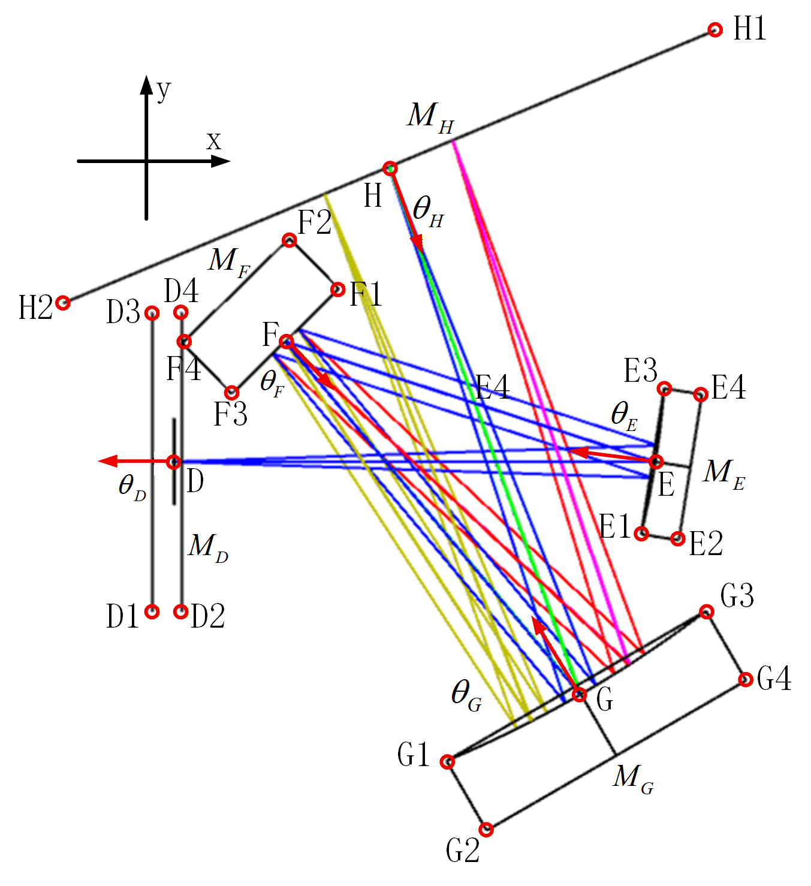

## 位置与方向角


其中，

$A，B，...，H$表示器件坐标，

$\theta_A，\theta_B，...，\theta_H$表示器件方向角

$M_A，M_B，...，M_H$表示器件

### 器件坐标（单位：mm，小数位：3）
$A=[-10.400, -40.000]$

$B=[-25.400, -40.000]$

$C=[-25.400, 0.000]$

$D=[0.000, 0.000]$

$E=[52.000, 0.000]$

$F=[5.485, 18.339]$

$G=[31.299, -35.824]$

$H=[31.922, 33.174]$

### 器件方向角（单位：°，小数位：3）

$\theta_A=180.000$

$\theta_B=90.000$

$\theta_C=-90.000$

$\theta_D=180.000$

$\theta_E=169.241$

$\theta_F=-59.245$

$\theta_G=102.482$

$\theta_H=-85.623$

### 器件
#### $M_A$ （**暂无**）
1. 基本介绍
    ```
    名称：光纤
    作用：收集并输出指定NA的光束
    ```
2. 参数
    ```
    NA：0.15
    芯径：0.105 mm
    接口：SMA905
    ```
3. 购买
    ```
    国家：中国
    平台：淘宝
    链接：https://e.tb.cn/h.7rhfFBli7on9afj?tk=8xUmU7Y8vk0
    ```
#### $M_B$ （**暂无**）
1. 基本介绍
    ```
    名称：90°偏轴抛物线面反射镜
    作用：准直光线
    ```
2. 参数
    ```
    RFL：15 mm
    直径：1/2 英寸
    接口：无，裸镜片
    ```
3. 购买
    ```
    国家：海外，国内有代理商
    平台：索雷博
    链接：
        海外：https://www.thorlabs.com/item/MPD00M9-M01
        国内：https://www.thorlabschina.cn/zh/item/MPD00M9-M01?aID=7bab4be684e67eaf9004ae720c91b5f7&aC=1
    ```
#### $M_C$ （**暂无**）
1. 基本介绍
    ```
    名称：90°偏轴抛物线面反射镜
    作用：汇聚光线
    ```
2. 参数
    ```
    RFL：25.4 mm
    直径：1/2 英寸
    接口：无，裸镜片
    ```
3. 购买
    ```
    国家：海外，国内有代理商
    平台：索雷博
    链接：
        海外：https://www.thorlabs.com/item/MPD019-M01
        国内：https://www.thorlabschina.cn/zh/item/MPD019-M01?aID=7bab4be684e67eaf9004ae720c91b5f7&aC=1
    ```
#### $M_D$ （**已有**）
1. 基本介绍
    ```
    名称：光学狭缝
    作用：削弱光线芯径带来的离轴偏移视场对分辨率的影响
    ```
2. 参数
    ```
    狭缝宽：5/10mm
    直径：1 英寸
    接口：已安装
    ```
3. 购买
    ```
    国家：海外，国内有代理商
    平台：索雷博
    链接：
        海外：
            5mm：https://www.thorlabs.com/item/S5K
            10mm：https://www.thorlabs.com/item/S10K
        国内：
            5mm：https://www.thorlabschina.cn/zh/item/S5K
            10mm：https://www.thorlabschina.cn/zh/item/S10K
    ```
#### $M_E$ （**已有，但材质不太合适**）
1. 基本介绍
    ```
    名称：凹面镜
    作用：准直光线——为光栅提供平行光
    ```
2. 参数
    ```
    焦距：50 mm
    直径：1 英寸
    接口：裸镜片
    ```
3. 购买
    ```
    国家：海外，国内有代理商
    平台：索雷博
    链接：
        海外：https://www.thorlabs.com/item/CM254-050-M01
        国内：https://www.thorlabschina.cn/zh/item/CM254-050-M01
    ```
#### $M_F$ （**无**）
1. 基本介绍
    ```
    名称：光栅
    作用：分光
    ```
2. 参数
    ```
    刻线密度：400 线/mm
    长宽：1 英寸
    接口：裸镜片
    ```
3. 购买
    ```
    国家：海外，国内有代理商
    平台：newport
    链接：
        海外：https://www.thorlabs.com/item/CM254-050-M01
        国内：https://www.thorlabschina.cn/zh/item/CM254-050-M01
    ```


$B=[-25.400, -40.000]$

$C=[-25.400, 0.000]$

$D=[0.000, 0.000]$

$E=[52.000, 0.000]$

$F=[5.485, 18.339]$

$G=[31.299, -35.824]$

$H=[31.922, 33.174]$