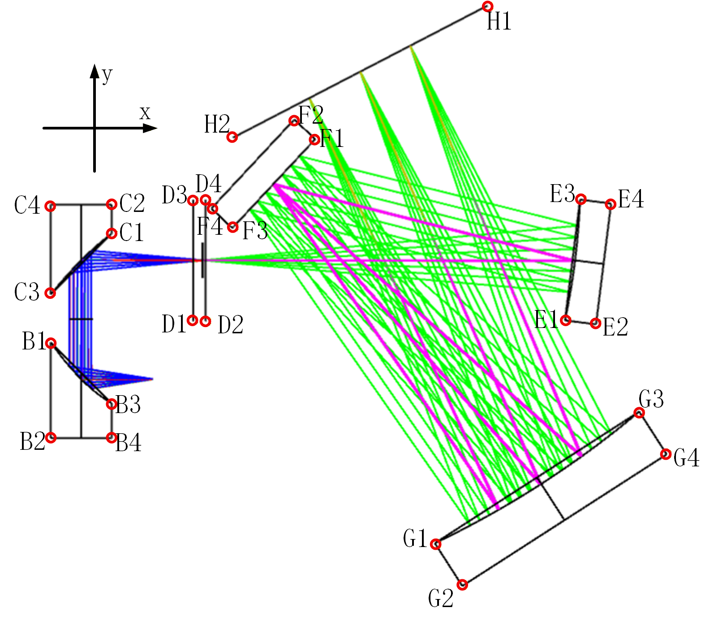

## 位置与方向角



其中，

$A，B，...，H$表示中心光线与器件交点坐标

$B1, B2, ..., C1, C2, ..., H4$表示器件顶点坐标

$\theta_A，\theta_B，...，\theta_H$表示器件方向角

$M_A，M_B，...，M_H$表示器件

### 器件坐标（单位：mm，小数位：3）
#### $A$
$A=[-10.400, -24.800]$
#### $B$
$B=[-25.400, -24.800]$

$B1=[-31.750, -17.100]$

$B2=[-31.750, -37.100]$

$B3=[-19.050, -29.900]$

$B4=[-19.050, -37.100]$
#### $C$
$C=[-25.400, 0.000]$

$C1=[-19.050, 5.700]$

$C2=[-19.050, 11.700]$

$C3=[-31.75, -7.100]$

$C4=[-31.750, 11.700]$
#### $D$
$D=[0.000, 0.000]$

$D1=[-1.875, -12.700]$

$D2=[0.625, -12.700]$

$D3=[-1.875, 12.700]$

$D4=[0.625, 12.700]$
#### $E$
$E=[77.870, 0.000]$

$E1=[75.797, -12.540]$

$E2=[82.247, -13.347]$

$E3=[78.950, 12.664]$

$E4=[85.400, 11.857]$
#### $F$
$F=[14.873, 16.013]$

$F1=[23.539, 25.297]$

$F2=[19.153, 29.391]$

$F3=[6.207, 6.729]$

$F4=[1.821, 10.823]$
#### $G$
$G=[70.793, -46.668]$

$G1=[48.562, -59.058]$

$G2=[54.295, -67.975]$

$G3=[91.293, -31.586]$

$G4=[97.027, -40.503]$
#### $H$
$H=[32.954, 39.380]$

$H1=[59.593, 53.176]$

$H2=[6.315, 25.583]$

### 器件方向角（单位：°，小数位：3）

$\theta_A=180.000$

$\theta_B=90.000$

$\theta_C=-90.000$

$\theta_D=180.000$

$\theta_E=172.869$

$\theta_F=-43.028$

$\theta_G=122.737$

$\theta_H=-62.620$

### 器件
#### $M_A$ （**暂无**）
1. 基本介绍
    ```
    名称：光纤
    作用：收集并输出指定NA的光束
    ```
2. 参数
    ```
    NA：0.15
    芯径：0.105 mm
    接口：SMA905
    ```
3. 购买
    ```
    国家：中国
    平台：淘宝
    链接：https://e.tb.cn/h.7rhfFBli7on9afj?tk=8xUmU7Y8vk0
    ```
#### $M_B$ （**暂无**）
1. 基本介绍
    ```
    名称：90°偏轴抛物线面反射镜
    作用：准直光线
    ```
2. 参数
    ```
    RFL：15 mm
    直径：1/2 英寸
    接口：无，裸镜片
    ```
3. 购买
    ```
    国家：海外
    平台：索雷博
    链接：https://www.thorlabschina.cn/zh/item/MPD00M9-M01
    ```
#### $M_C$ （**暂无**）
1. 基本介绍
    ```
    名称：90°偏轴抛物线面反射镜
    作用：汇聚光线
    ```
2. 参数
    ```
    RFL：25.4 mm
    直径：1/2 英寸
    接口：无，裸镜片
    ```
3. 购买
    ```
    国家：海外
    平台：索雷博
    链接：https://www.thorlabschina.cn/zh/item/MPD019-M01
    ```
#### $M_D$ （**已有**）
1. 基本介绍
    ```
    名称：光学狭缝
    作用：削弱光线芯径带来的离轴偏移视场对分辨率的影响
    ```
2. 参数
    ```
    狭缝宽：5/10mm
    直径：1 英寸
    接口：已安装
    ```
3. 购买
    ```
    国家：海外
    平台：索雷博
    链接：
        5mm：https://www.thorlabschina.cn/zh/item/S5K
        10mm：https://www.thorlabschina.cn/zh/item/S10K
    ```
#### $M_E$ （**已有**）
1. 基本介绍
    ```
    名称：凹面镜
    作用：准直光线——为光栅提供平行光
    ```
2. 参数
    ```
    焦距：75 mm
    直径：1 英寸
    接口：裸镜片
    ```
3. 购买
    ```
    国家：海外
    平台：索雷博
    链接：https://www.thorlabschina.cn/zh/item/CM254-075-M01
    ```
#### $M_F$ （**暂无**）
1. 基本介绍
    ```
    名称：光栅
    作用：分光
    ```
2. 参数
    ```
    刻线密度：300 线/mm
    长宽：1 英寸
    接口：裸镜片
    ```
3. 购买
    ```
    国家：海外
    平台：索雷博
    链接：https://www.thorlabschina.cn/zh/item/GR25-0310
    ```
#### $M_G$ （**暂无**）
1. 基本介绍
    ```
    名称：凹面镜
    作用：汇聚光线到传感器
    ```
2. 参数
    ```
    焦距：100 mm
    直径：2 英寸
    接口：裸镜片
    ```
3. 购买
    ```
    国家：海外
    平台：索雷博
    链接：https://www.thorlabschina.cn/zh/item/CM508-100-M01
    ```
#### $M_H$ （**已有**）
1. 基本介绍
    ```
    名称：InGaAs传感器
    作用：采集不同波段的光线
    ```
2. 参数
    ```
    单像素尺寸：12.5 x 125 微米
    像素数量：1024
    ```
3. 购买
    ```
    未知
    ```