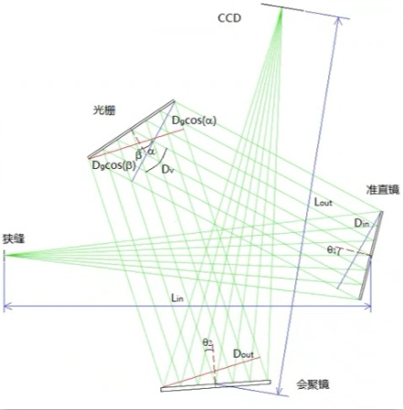
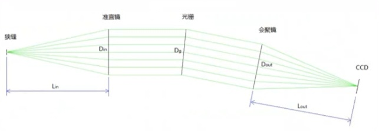

## 光谱探测器类型
* CCD
* CMOS
* InGaAs
## 数值孔径($NA$)、相对孔径($1/F\#$)
* $NA=nsin(\Theta)$，$n$为入射空间介质的折射率，空气的$n=1$
* $F\#=\frac{1}{2NA}$
## 光栅方程
反射式光栅在空气中：
$$sin(\alpha)+sin(\beta)=10^{-6}kf\lambda \tag{1}$$
其中，$\alpha$(度)：光栅入射角；$\beta$(度)：光栅衍射角；$k$(整数)：光栅衍射级；$f$($lines/mm$)：光栅刻线密度；$\lambda$($nm$)：在空气中的使用波长

C-T光谱仪光栅入射角$\alpha$固定不变，而光栅衍射角$\beta$随波长改变而改变

光栅夹角是光栅衍射角与入射角之间的夹角
$$D_v=\beta-\alpha \tag{2}$$
根据公式$(1)、(2)$
$$\alpha=arcsin(\frac{10^{-6}kf\lambda}{2cos\frac{D_v}{2}})-\frac{D_v}{2} \tag{3}$$
$$\beta=D_v+\alpha=\frac{D_v}2+arcsin(\frac{10^{-6}kf\lambda}{2cos\frac{D_v}{2}}) \tag{4}$$
其中$D_v，k，、\alpha，\beta$需要注意正负号，以便$\alpha$和$\beta$符合实际情况

### ===========But===========一般不按$(2)(3)(4)$这么算，常用以下方法计算，别问为什么，我也不知道
$$\Phi=\alpha+\beta \tag{2}$$
$$\alpha=\frac{\Phi}{2}+arcsin(\frac{10^{-6}kf\lambda}{2cos\frac{D_v}{2}}) \tag{3}$$
$$\beta=\Phi-\alpha \tag{4}$$
## 角色散、线色散
对光栅方程$(1)$两边进行微分
$$d(sin(\alpha)+sin(\beta))=d(10^{-6}kf\lambda)$$
可得到
$$cos(\beta)d\beta=10^{-6}kfd\lambda$$
从而得到角色散
$$\frac{d\beta}{d\lambda}=\frac{10^{-6}kf}{cos(\beta)} \tag{5}$$
假设出射距离为$L_{out}$
$$\frac{d\beta}{d\lambda}L{out}=\frac{10^{-6}kf}{cos(\beta)}L{out}$$
则线色散
$$\frac{dL}{d\lambda}=\frac{10^{-6}kf}{cos(\beta)}L_{out} \tag{6}$$
实际中使用的一般是倒线色散
$$\frac{d\lambda}{dL}=\frac{10^{6}cos(\beta)}{kfL_{out}} \tag{7}$$
## 光谱仪的入射距离$L_{in}$、出射距离$L_{out}$

光谱仪f数包括入射端f数和出射端f数，他们分别为
$$f_{in}=\frac{L_{in}}{D_{in}},f_{out}=\frac{L_{out}}{D_{out}} \tag{8}$$
而
$$D_{in}=D_C cos\theta_1=D_g cos\alpha$$
$$D_{out}=D_F cos\theta_2=D_g cos\beta$$
其中$D_g$为光栅通光口径，$D_C$为准直镜通光口径，$D_F$为会聚镜通光口径，$\theta_1$为准直镜转角，$\theta_2$为会聚镜转角

C-T光谱仪中倒线色散
$$\frac{\lambda_2-\lambda_1}{L_{CCD}}$$
一般色谱在CCD上均匀分布，所以结合公式$(7)$，可得出射距离$L_{out}$
$$L_{out}=\frac{L_{CCD}cos(\beta)10^6}{kf(\lambda_2-\lambda_1)} \tag{9}$$
$L_{CCD}$为有效感光长度，再结合水平放大倍率
$$M=\frac{f_{out}}{f_{in}}$$
以及公式$(8)$及其后面的式子，可得入射距离$L_{in}$
$$L_{in}=\frac{L_{out}cos\alpha}{Mcos\beta} \tag{10}$$

## 会聚镜与准直镜的焦距$f$、曲率半径$R$
准直镜的焦距
$$f_C=\frac{R_1}{2}$$
会聚镜的焦距
$$f_F=\frac{R_2}{2}$$
而
$$f_{in}=\frac{f_C}{D_C}$$
$$f_{out}=\frac{f_F}{D_F}$$
再结合公式$(8)$可得
$$L_{in}=\frac{R_1}{2}cos\theta_1,L_{out}=\frac{R_2}{2}cos\theta_2 \tag{11}$$
$$R_1=\frac{2L_{in}}{cos\theta_1}, R_2=\frac{2L_{out}}{cos\theta_2} \tag{12}$$
$$f_C=\frac{L_{in}}{cos\theta_1}, f_F=\frac{L_{out}}{cos\theta_2} \tag{13}$$
## 准直镜到光栅的距离$d_1$、光栅到会聚镜的距离$d_2$
准直镜到光栅的距离
$$d_1=(1-\frac{1}{\sqrt{3}})R_1=(1-\frac{1}{\sqrt{3}})\frac{2L_{in}}{cos\theta_1} \tag{14}$$
会聚镜到光栅的距离
$$d_2=(1-\frac{1}{\sqrt{3}})R_2=(1-\frac{1}{\sqrt{3}})\frac{2L_{out}}{cos\theta_2} \tag{15}$$
C-T光谱仪的消慧差公式
$$\frac{sin\theta_2}{sin\theta_1}=\frac{R_2^2}{R_1^2}\frac{(cos\theta_2)^3}{(cos\theta_1)^3}\frac{(cos\alpha)^3}{(cos\beta)^3} \tag{16}$$
再结合公式$(10)$与$(12)$可得
$$\frac{tan\theta_2}{tan\theta_1}=\frac{L_{out}^2(cos\alpha)^3}{L_{in}^2(cos\beta)^3}=M^2\frac{cos\alpha}{cos\beta} \tag{17}$$
根据公式$(17)$，并且已知$\theta_1、M、\alpha、\beta$，可以求$\theta_2$

## 入射狭缝的宽度与高度
由狭缝像宽$\omega'$与狭缝宽$\omega$之比等于放大倍率$M$，结合公式(10)可得狭缝像宽$\omega'$
$$\omega'=\frac{\omega L_{out}cos\alpha}{L_{in}cos\beta} \tag{18}$$
再由
$$\Delta\lambda=\omega'\frac{d\lambda}{dL}$$
可得
$$\omega=\frac{\Delta\lambda kfL_{in}}{cos\alpha 10^6} \tag{19}$$
公式$(19)$这里得到入射狭缝宽是偏大的，这里添加一个修正系数$\mu=0.63$使公式$(20)$得到更接近实际入射狭缝宽度
$$\omega=\frac{\Delta\lambda kfL_{in}}{cos\alpha 10^6}\times\mu \tag{20}$$
狭缝像高$h'$与狭缝高$h$之比为
$$\frac{h'}{h}=\frac{L_{out}}{L_{in}} $$
## 仪器的光谱分辨率
C-T光谱仪的光谱分辨率$\Delta\lambda=FWHM\times线色数$，实际光谱仪中某特征谱线的$FWHM$主要由四个谱线展宽因子的卷积决定，这四个因子分别为：入射狭缝、光学系统剩余像差、光学系统衍射极限、光源本身光谱的谱线宽。而$FWHM$定义：是指在光谱强度峰值的50%时，所对应光谱波形的线宽。

这里可以把$FWHM=\omega'$近似处理，根据公式$(20)$
$$\Delta\lambda=\frac{\omega cos\alpha 10^6}{kfL_{in}\mu} \tag{21}$$