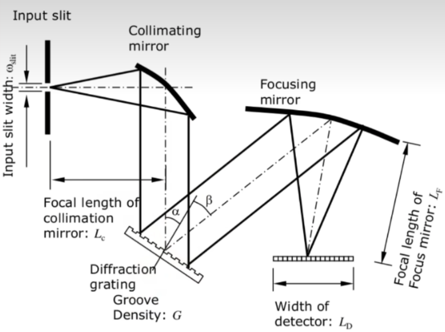
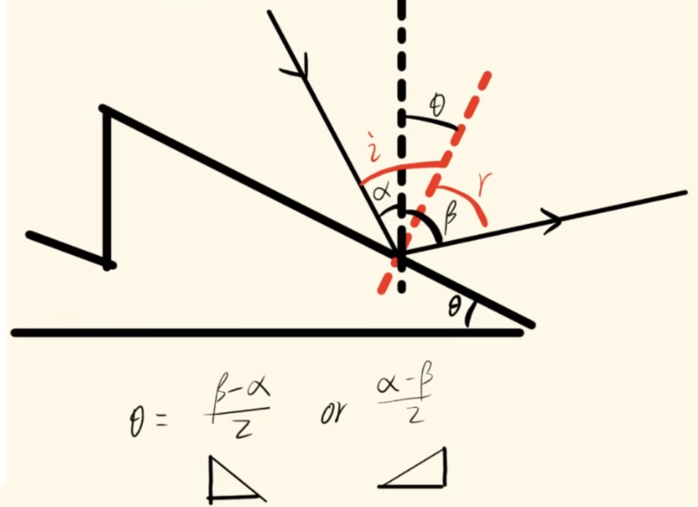
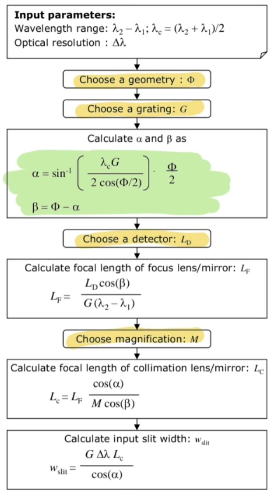

## 光谱仪参数计算
From [bilibili](https://www.bilibili.com/video/BV1dTUmYWEwC?-Arouter=story&buvid=XXF85FDFC7341D916898FBDAEDF516A4E2125&from_spmid=united.player-video-detail.drama-float.0&is_story_h5=false&mid=knxTOX6HOG%2Bvq37uzWGZZA%3D%3D&plat_id=191&share_from=ugc&share_medium=harmony&share_plat=harmony&share_session_id=bca85976-6b59-46aa-aa83-1b33c9c49abf&share_source=WEIXIN&share_tag=s_i&timestamp=1766483510&unique_k=2fbTohl&up_id=663096739&vd_source=ee200f7e09eb8dbc8631c991d8917853&spm_id_from=333.788.videopod.sections)
### 原理图

### 参数
| 参数 | 符号表示 | 状态 |
|:------:|:------:|:----:|
| Minimum wavelength | $\lambda_1$ | 已知 &#x2705; |
| Maximum wavelength | $\lambda_2$ | 已知 &#x2705; |
| Wavelength range | $\lambda_2-\lambda_1$ | 已知 &#x2705; |
| Resolution | $\Delta\lambda$ | 自设 &#x26a0;&#xfe0f; |
| Center wavelength | $\lambda_C=\frac{\lambda_1+\lambda_2}{2}$ | 已知 &#x2705; |
|  |  |  |
| Angle of incidence | $\alpha=sin^{-1}(\frac{\lambda_C G}{2cos(\Phi/2)})+\frac{\Phi}{2}$ | 复杂计算 &#x1f4d6; |
| Diffraction angle | $\beta=\Phi-\alpha$ | 复杂计算 &#x1f4d6; |
|  | $\Phi=\alpha+\beta$ | 自设 &#x26a0;&#xfe0f; |
|  |  |  |
| Magnification | $M$ | 自设 &#x26a0;&#xfe0f; |
| Grating groove density | $G$ | 自设 &#x26a0;&#xfe0f; |
| Focal length collimation | $L_C=L_F\frac{cos(\alpha)}{M cos(\beta)}$ | 复杂计算 &#x1f4d6; |
| Focal length focus | $L_F=\frac{L_D cos(\beta)}{G(\lambda_2-\lambda_1)}, L_F=\frac{L_D cos(\beta)}{mG(\lambda_2-\lambda_1)}$ | 复杂计算 &#x1f4d6; |
| Detector width | $L_D$ | 自设 &#x26a0;&#xfe0f; |
| Input silt width | $\omega_{silt}=\frac{G\Delta\lambda L_C}{cos(\alpha)}$，$\omega_{silt}=\frac{mG\Delta\lambda L_C}{cos(\alpha)}$ | 复杂计算 &#x1f4d6; |
|  |  |  |
| 闪耀角 | $\theta=\frac{\beta-\alpha}{2}=\frac{\Phi}{2}-\alpha,\beta\gt\alpha$ | 复杂计算 &#x1f4d6; |
| 闪耀波长 | $\lambda_1+\frac{\lambda_2-\lambda_1}{4}$ |  已知 &#x2705; |
### 计算流程

|注意|
|:---:|
|$\omega_{silt}$ 与 $\Delta\lambda$ 强相关|
|闪耀角 $\theta$ 与 $\Phi$ 、 $G$ 强相关|
|$L_F$ 、 $L_C$ 与 $G$ 强相关|
|1200刻光栅，闪耀波长为500nm只有17.4闪耀角|
|一般买光栅的话，闪耀波长、光栅刻度 $G$ 、闪耀角度 $\theta$ 都是固定那几组，所以 $\Phi$ 一般要根据这些固定的稍微反向调整下|
| 一般先选 $\Phi=30\degree$，然后计算出 $\alpha$ 和 $\beta$，随后得出 $\theta$，之后根据相近的闪耀波长规格以及闪耀角，看看哪个光栅刻度合适，并反推 $\Phi$，不断调整，直到 $\Phi$ 、$\alpha$ 以及 $\beta$ 不变化 |
| $M$ 一般选 1| 

给定光栅刻线密度 $G$、衍射级次 $m$、工作波长 $\lambda$，
以及入射与衍射臂的夹角 $\Phi=\alpha+\beta$，
由光栅方程
$$
m\lambda G=\sin\alpha+\sin\beta
$$
并代入 $\beta=\Phi-\alpha$，可得
$$
\sin\alpha+\sin(\Phi-\alpha)
=
2\sin\!\left(\frac{\Phi}{2}\right)
\cos\!\left(\alpha-\frac{\Phi}{2}\right).
$$
因此，入射角 $\alpha$ 的闭式解为
$$
\alpha
=
\frac{\Phi}{2}
\pm
\arccos\!\left(
\frac{m\,\lambda\,G}{2\sin(\Phi/2)}
\right),
$$
并需满足可解条件
$$
\frac{m\,\lambda\,G}{2\sin(\Phi/2)} \le 1.
$$
